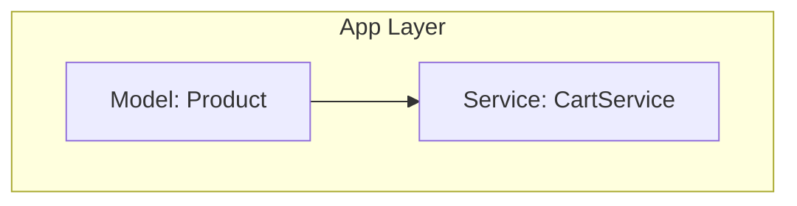
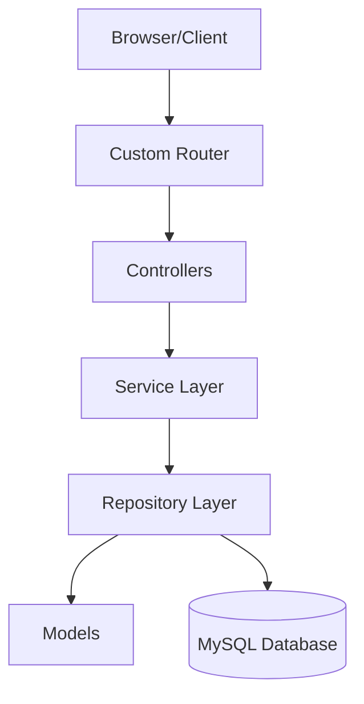

# Dokumentasi Arsitektur Sistem

## High Level Architecture
Proyek ini mengadopsi arsitektur **Modular Monolith** dengan pendekatan **MVC (Model-View-Controller)** yang dikombinasikan dengan **Service Layer** dan **Repository Pattern**.

Saat ini, implementasi baru mencakup bagian Model (representasi data) dan Service Layer (business logic).

### Component Diagram (Current Status)

### Component Diagram (Future Design)

## Service Diagram
Saat ini hanya `CartService` yang terimplementasi untuk menghitung total belanja. Komunikasi antar service belum ada (Status: Not Implemented / Planned).

## Data Flow Diagram
*(Status: Not Implemented / Planned)*

**Future Design:**
1. Request masuk ke Router.
2. Router meneruskan ke Controller.
3. Controller memanggil Service.
4. Service berinteraksi dengan Repository/Model.
5. Repository mengeksekusi query ke Database.
6. Hasil dikembalikan ke Controller untuk di-render sebagai View/JSON.

## Deployment Architecture
*(Status: Not Implemented / Planned)*
Lihat [Dokumentasi Deployment](../deployment/README.md) untuk detail environment.

## Scalability Strategy
*(Status: Not Implemented / Planned)*
Pendekatan Modular Monolith memungkinkan ekstraksi modul menjadi layanan mandiri di masa depan jika beban sistem meningkat secara signifikan.

## Security Architecture
*(Status: Not Implemented / Planned)*
Lihat [Dokumentasi Keamanan](../security/README.md).

## Monitoring Strategy
*(Status: Not Implemented / Planned)*
Belum ada implementasi logging dan metrik.
