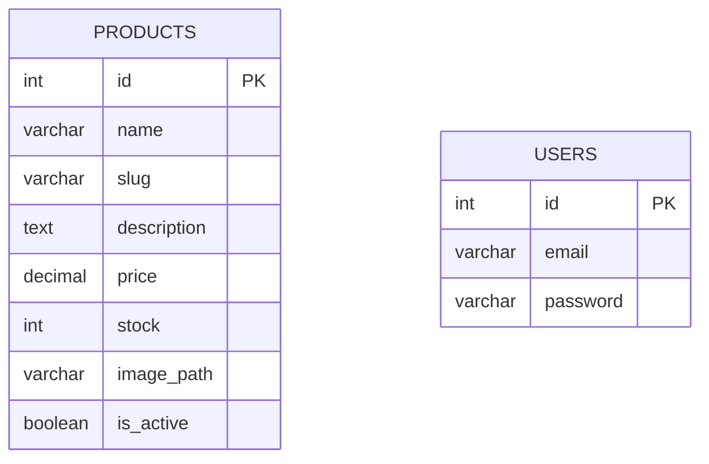

# Dokumentasi Database

> **Status Saat Ini:** Database belum diimplementasikan pada source code. Data saat ini dikelola menggunakan in-memory array dalam unit testing atau instansiasi objek `Product` secara langsung.

Berikut adalah rancangan desain (Future Design) untuk implementasi database di masa mendatang.

## Teknologi (Rencana)
*   **DBMS**: MySQL
*   **Akses Data**: PDO (PHP Data Objects) menggunakan metode raw SQL dan Repository Pattern, tanpa ORM.

## ERD (Entity Relationship Diagram) - Future Design

## Relasi Tabel
*(Belum ada relasi yang diimplementasikan. Status: Not Implemented / Planned)*

## Deskripsi Tabel (Future Design)

### Tabel `products`
Berdasarkan struktur model `Product.php`:
| Field | Tipe Data | Keterangan |
| :--- | :--- | :--- |
| `id` | INT | Primary Key |
| `name` | VARCHAR | Nama produk |
| `slug` | VARCHAR | Slug untuk URL ramah SEO |
| `description` | TEXT | Deskripsi detail produk |
| `price` | DECIMAL/INT | Harga produk |
| `stock` | INT | Jumlah stok tersedia |
| `image_path` | VARCHAR | Path/URL gambar produk |
| `is_active` | BOOLEAN | Status aktif/non-aktif produk |

## Constraint & Index
*(Status: Not Implemented / Planned)*

## Migration Guide
*(Mekanisme migrasi database belum ada. Saat ini direncanakan menggunakan raw SQL script. Status: Not Implemented / Planned)*

## Backup & Restore Guide
*(SOP atau script backup/restore belum tersedia. Status: Not Implemented / Planned)*
